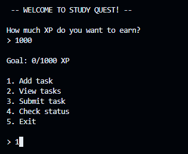
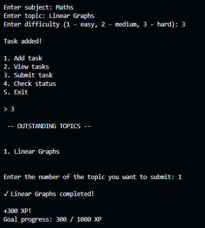
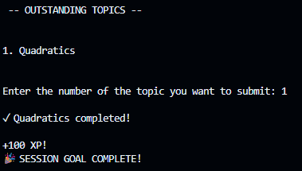

# Study-Quest
Study Quest turns what can sometimes be boring - studying - into something more engaging and rewarding! Students add in their tasks, and complete them to earn XP. This XP is used in a level system and can motivate children to study. Students can add their study tasks, rate their difficulty, and complete them to earn XP. Study Quest uses this XP to track progress and encourage students to approach their workload as a series of achievable quests.
The goal is to make studying feel less overwhelming and more positive by adding a simple game-like progression system.

## How to Run

### Requirements

- Python 3.x

### Installation

1. Clone or download this repository.
2. Open a terminal in the project folder.
3. Run:

python studyquest.py

5. Open the repository folder in a Python-compatible IDE or terminal

## Features

* **Task creation** - Add study tasks with a subject, topic, and difficulty.
* **Difficulty-based XP** - Easy, medium, and hard tasks award different amounts of XP.
* **Task completion** - Submit completed tasks and automatically receive XP.
* **Session goals** - Set an XP target for your study session and track your progress towards it.
* **Task management** - View outstanding tasks and remove them when completed.
* **Progress tracking** - Check your current XP and session progress.
* **Input validation** - Handles invalid task numbers and other unexpected inputs.

## How It Works

Study Quest stores each study task as a dictionary containing its subject, topic, and difficulty. These task dictionaries are stored inside a list, allowing multiple tasks to be managed at once.

When a task is completed, its difficulty determines how much XP the user earns. Easy tasks award 100 XP, medium tasks award 200 XP, and hard tasks award 300 XP.

The user can also set an XP goal at the beginning of a session. As tasks are completed, the user's XP progress is displayed and the program announces when the session goal has been reached.

The program is organised into separate functions for adding tasks, viewing tasks, completing tasks, and checking progress, with a main menu connecting these features together.

## Tech Stack

* **Python** - Used to build the entire Study Quest program.
* **GitHub** - Used to store and share the project repository.
* **GitHub Codespaces** - Used as the development environment.
* **GitHub Copilot and ChatGPT** - Used for AI-assisted suggestions and development support.

## Screenshots

### Main Menu

### Tasks and XP

### Goal Completed

